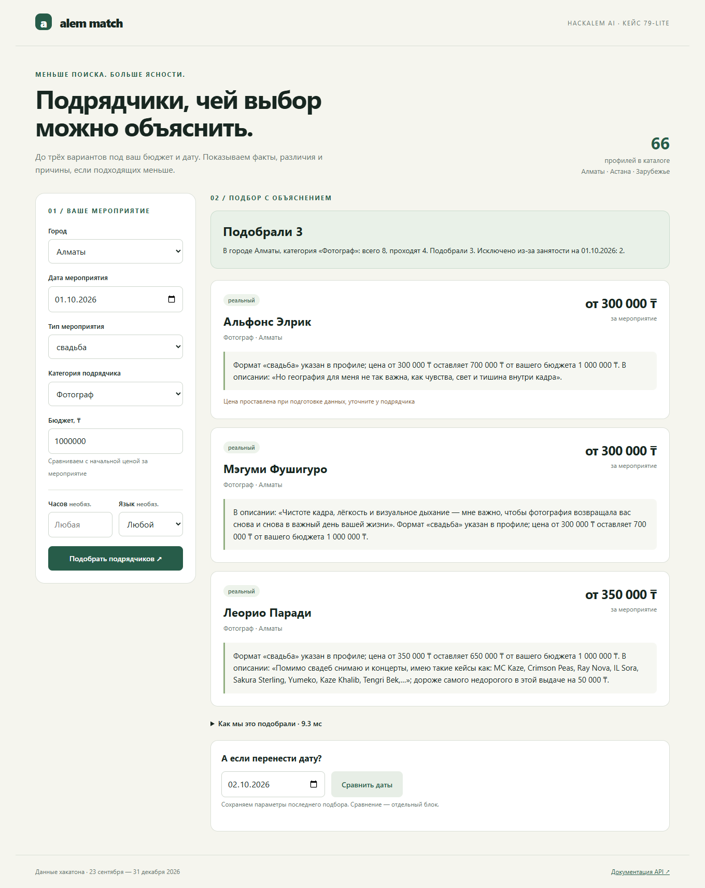
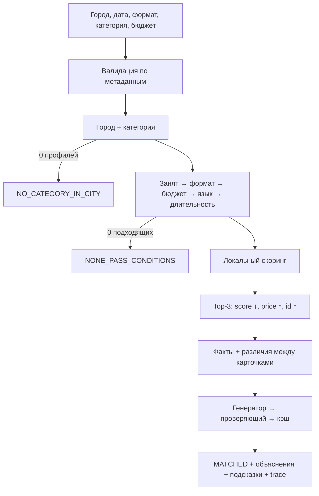

# Alem Match

## 2. Краткое описание

**Умный подбор подрядчиков с проверяемыми объяснениями.** Проект для HackAlem AI, кейс «Умный подбор подрядчиков (#79-lite)».

Заказчик задаёт город, дату, формат, категорию и бюджет. Сервис возвращает максимум три подходящих профиля и объясняет различия: начальную цену, остаток бюджета, условия работы и конкретную деталь описания. Занятые подрядчики всегда исключаются.



## 3. Что реализовано

- 66 профилей из предоставленного организаторами CSV, преобразованных в JSONL без изменения цен и календарей.
- Строгие фильтры; язык и длительность учитываются только при заполнении.
- До трёх карточек, отдельные бейджи синтетики и пометки о восстановленных данных.
- Три различимых результата, числовое объяснение пустой и короткой выдачи.
- Детерминированное ранжирование, локальные векторы, воспроизводимые объяснения и кэш.
- Подсказки по соседним датам, достаточному бюджету и городам; сравнение двух дат.
- FastAPI, CLI, адаптивный интерфейс без сборки, раскрываемый trace.
- 31 автоматический тест, сценарии демо, офлайн-eval, GitHub Actions.
- Dockerfile и Compose для воспроизводимого запуска; Docker-сборка локально не проверялась.

## 4. Как работает решение



**MATCHED — «Подобрали N».** Если прошедших меньше трёх, показываются все; summary сообщает размер исходной группы и основные причины исключения с числами.

**NO_CATEGORY_IN_CITY — «В городе нет этой категории».** Нет ни одного профиля запрошенной категории в выбранном городе. Отдельно указываются города, где категория есть.

**NONE_PASS_CONDITIONS — «Никто не проходит по условиям».** Кандидаты есть, но не проходят фильтры. Каждый исключённый учитывается один раз по порядку: занят → формат → бюджет → язык → длительность. Все дополнительные причины остаются в trace.

Занятость отражена в summary каждого ответа. Декабрьская высокая загрузка объясняется числами. Дата за пределами 23.09–31.12.2026 и неверные параметры дают HTTP 422 / INVALID_INPUT с допустимыми значениями.

### Объяснения

Шесть ориентиров: конкретность, привязка к запросу, различимость, обоснованность, честное сравнение, 1–2 предложения.

Факты извлекаются правилами: цена и разницы вычисляются, цитата берётся дословно из описания. Имена и короткие представления исключаются из отличительных деталей. У карточки есть уникальная цитата либо отличающаяся цена; более дорогой вариант явно сравнивается с самым недорогим в показанной тройке.

Офлайн-генератор составляет два предложения. Опциональный OpenAI-провайдер выбирает порядок этих предложений сразу для всех карточек. Critic проверяет закрытую грамматику, стоп-фразы, форму, параметры и отличительные факты; произвольные утверждения и новые числа не принимаются. Некорректный план запрашивается повторно один раз, сетевой сбой переводит запрос на шаблонный вариант. Это ограниченный планировщик текста, а не свободный LLM-копирайтер.

Ключ кэша — SHA-256 нормализованного запроса, фактов и версии генератора. Демо-кэш хранится в data, новые ответы — в локальной SQLite-базе .cache. Удаление локального кэша может изменить порядок предложений в API-режиме; порядок карточек останется прежним.

Подсказки не добавляют карточек: например, кандидат, исключённый только по бюджету, появился бы при указанной минимальной сумме. Дата предлагается лишь после повторной проверки остальных условий. Непоказанные подрядчики в подсказках не называются.

[Офлайн-оценка](docs/EVAL.md): 918 запросов, 265 объяснений, 100% прохождения critic, 0% стоп-фраз, 100% привязки к запросу, 100% автоматического сопоставления без имён. p95 последнего замера — 5,351 мс без времени запуска процесса. Это автоматические метрики на данном датасете, не независимая оценка качества человеком и не результат живого API.

## 5. Технологии

Python 3.11+, FastAPI, Pydantic, Uvicorn, httpx, PyYAML, SQLite, pytest, HTML/CSS/JavaScript. Проект разработан с помощью AI-агента **Codex**.

Режим по умолчанию: **полностью офлайн**, TF-IDF и косинусная близость. Векторы предвычислены и включены в репозиторий.

Необязательные интеграции: OpenAI text-embedding-3-small для явной пересборки векторов и gpt-4o-mini для structured-output плана объяснений. Ключ не нужен для запуска. Реальные вызовы API в этой поставке не выполнялись; [подробности и официальная документация](docs/OPENAI.md).

## 6. Архитектура проекта

```text
app/
  api.py, cli.py       HTTP и консольный интерфейс
  pipeline.py         валидация, фильтры, выдача, подсказки, сравнение
  data.py, models.py  строгие модели и загрузка
  filters.py          порядок основных причин
  scoring.py          локальные векторы и детерминированный score
  facts.py            дословные детали и вычисленные контрасты
  explain/            шаблоны, critic, генератор, кэш
  llm/                интерфейсы и Offline/OpenAI-провайдеры
data/                 исходный JSONL, факты, векторы и демо-кэш
scripts/              импорт, инспекция, подготовка векторов, demo, eval
static/index.html     UI без CDN и frontend-сборки
tests/                контракт, объяснения, честность, API, кэш
docs/                 данные, метрики, демо, соответствие и pitch
```

Веса в config.yaml. Пусть r = price / budget:

- budget_fit = max(0, 1 − |r − 0,75| / 0,75): максимум при использовании 75% бюджета; дешевле не всегда лучше.
- semantic_fit = cosine(description_vector, event × category × optional_language).
- language_fit = 1 для совпавшего заданного языка.
- hours_fit = min(1, max_hours / hours), либо 1 при max_hours=null.
- Итог — взвешенное среднее активных компонентов минус 0,015 за каждый флаг price_imputed / city_imputed. Веса: 0,30 / 0,50 / 0,10 / 0,10.

Незаданные опциональные компоненты удаляются вместе с их весами. После жёстких фильтров язык и часы дают нейтральный балл прошедшим; несуществующий запрос не штрафуется. Итог округляется до 4 знаков, сортируется по score ↓, цене ↑, строковому id ↑. LLM к скорингу доступа не имеет.

Векторный кэш проверяется по хэшу каталога. Если кэш не соответствует данным или нет записи, используется TF-IDF. [Подробная схема](docs/ARCHITECTURE.md).

## 7. Установка и запуск

Нужен установленный Python 3.11 или новее. Перейдите в корень проекта.

**Windows PowerShell:**

```powershell
py -3 -m venv .venv
.\.venv\Scripts\python.exe -m pip install -r requirements.txt
.\.venv\Scripts\python.exe -m uvicorn app.api:app --host 127.0.0.1 --port 8000
```

**Linux / macOS:**

```bash
python3 -m venv .venv
source .venv/bin/activate
python -m pip install -r requirements.txt
python -m uvicorn app.api:app --host 127.0.0.1 --port 8000
```

Откройте [интерфейс](http://localhost:8000) или [Swagger API](http://localhost:8000/docs). Без .env всё работает офлайн.

Для OpenAI скопируйте .env.example в .env, заполните OPENAI_API_KEY и установите LLM_PROVIDER=openai. Не добавляйте .env в Git. Запуск сервера прежний. Для замены TF-IDF на настоящие OpenAI-векторы явно выполните:

```bash
python -m scripts.build_embeddings --provider openai
```

Перезапустите сервер после изменения данных или векторов. Этот шаг отправляет анонимизированные описания в API и расходует квоту. Возврат к локальным векторам: python -m scripts.build_embeddings --provider tfidf.

**Docker (не требует локального Python):**

```bash
docker compose up --build
```

Compose по умолчанию запускается офлайн на порту 8000.

**CLI:**

```bash
python -m app.cli --city Алматы --date 2026-10-01 --event свадьба --category Фотограф --budget 1000000 --json
python -m app.cli --city Астана --date 2026-11-14 --event корпоратив --category Фотограф --budget 200000 --hours 5 --lang казахский --no-team-synthetic
```

На Windows вместо python можно использовать .\.venv\Scripts\python.exe. Без --json CLI печатает summary, карточки, hints и trace. Неверный ввод завершает CLI кодом 2.

API: GET /health, GET /meta, POST /recommend, POST /compare-dates. Пример тела /recommend:

```json
{"city":"Алматы","date":"2026-10-01","event":"свадьба","category":"Фотограф","budget":1000000,"hours":null,"lang":null}
```

Для /compare-dates добавьте поле "second_date":"2026-10-02".

**Публикация на GitHub:** загрузите содержимое папки проекта в репозиторий команды, выданный платформой. Если репозиторий уже существует, сначала клонируйте его и скопируйте файлы проекта в рабочую папку, сохранив его .git. Затем:

```bash
git add .
git commit -m "Add Alem Match hackathon solution"
git push
```

Архив не содержит ключей, виртуального окружения и локального SQLite-кэша. Адрес удалённого репозитория не задан; автоматическая публикация не выполнялась.

## 8. Как проверить решение

```bash
python -m pytest -q
python -m scripts.inspect_data
python -m scripts.demo
python -m scripts.eval_explanations
```

Последний прогон: **31 passed**, одно предупреждение совместимости Starlette/AnyIO без падений. Локальная среда проверки — Python 3.12; GitHub Actions настроен на 3.11 и 3.12, но удалённый workflow ещё не запускался.

demo.py сам находит сценарии в данных:

1. Плотная категория → MATCHED, 3 карточки из более чем трёх подходящих.
2. Редкая → MATCHED, одна карточка в найденном сценарии, без дополнения каталога.
3. Бюджет 1 ₸ → NONE_PASS_CONDITIONS.
4. Две даты → изменившаяся тройка и объяснение занятости.
5. Три повтора + новый процесс без ключа → одинаковый SHA-256 списка id.
6. Отсутствующая категория в городе → NO_CATEGORY_IN_CITY на исходном каталоге.

[Полный вывод демо](docs/demo_output.md), [10 полных примеров](docs/EXPLANATION_SAMPLES.md), [отчёт проверки](docs/TEST_REPORT.md), [R1–R6 → код → тесты](docs/COMPLIANCE.md).

Живой OpenAI-eval запускается отдельно и явно: python -m scripts.eval_explanations --live. Требуется ключ; результат сохраняется в docs/EVAL_LIVE.md. Перед ним выполните demo для подготовки запросов.

## 9. Данные и интеграции

Источник — предоставленный CSV hackathon dataset anonymized .csv: копия data-source.csv и типизированная версия data/hackathon-dataset-anonymized.jsonl. Импорт воспроизводится:

```bash
python -m scripts.import_csv data-source.csv
```

В исходных данных 66 профилей: Алматы — 50, Астана — 15, Зарубежье — 1. Организаторы пометили 13 профилей как synthetic. Без цены — 0; без max_hours — 9; восстановленный город — 8; восстановленная цена — 18. [Полный отчёт](docs/DATA_REPORT.md).

**Собственная синтетика не добавлена.** При необходимости командные профили загружаются только из data/team_synthetic.jsonl с synthetic=true и source=team, выключаются через --no-team-synthetic в CLI или INCLUDE_TEAM_SYNTHETIC=false в API.

Реальных календарных интеграций нет. Внешние API не используются без явного включения OpenAI. Предоставленные данные не обогащались сетевыми источниками.

## 10. Ограничения

- Это рекомендация по статическому датасету: не бронирование, не подтверждение доступности и не коммерческое предложение. Цена указана «от».
- Календарь ограничен 23.09–31.12.2026.
- Закоммиченные векторы — TF-IDF. **OpenAI-эмбеддинги не сгенерированы**; код подготовки есть, требуется ключ.
- Не реализованы LLM-извлечение фактов и свободный LLM-генератор объяснений. Используются точные фрагменты и проверяемые предложения, LLM может выбрать их порядок.
- Critic не является универсальным фактчекером произвольной прозы; свободные даты типа «14 ноября» не нормализует, поскольку в сгенерированных объяснениях их нет.
- Контраст по цене реализован; отдельные превосходные сравнения по всем языкам и запасу часов, а также сравнение силы семантики не реализованы.
- Не реализован единый critic для подсказок; их условия и числа вычисляются напрямую и проверяются тестами.
- Живой API-eval, LLM-судья и независимое ручное слепое тестирование не проведены. Docker-сборка и удалённый CI в данной среде не запускались.
- Не реализованы POST /parse-query, NVIDIA-провайдер и облачный деплой.
- Нет векторной БД, обучения весов, мультиязычных объяснений, комплектов подрядчиков, реальных календарей, rate limit и аутентификации.
- Если будущие профили неразличимы по доступным фактам, система отмечает это в trace; гарантировать уникальные объяснения для полностью одинаковых записей нельзя.

[План развития](docs/ROADMAP.md) и [сценарий защиты](docs/PITCH.md).

## 11. Ссылка на deployed-версию

Публичного деплоя пока нет. Локальный адрес после запуска: [localhost:8000](http://localhost:8000).
