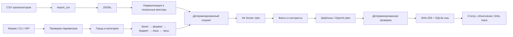

# Архитектура

Один процесс FastAPI, каталог из 66 профилей и векторы в памяти. UI — статический HTML, без CDN и сборщика. CLI и API вызывают один Engine.

Данные и конфигурация версионируются. Эмбеддинги привязаны к SHA-256 полного каталога; при несовпадении используется локальный TF-IDF. Это исключает использование старых эмбеддингов с новыми описаниями. Правила фильтрации всегда применяются до скоринга.

Объяснения используют закрытую грамматику: числовые утверждения вычисляются кодом, детали — дословные фрагменты описания. LLM выбирает порядок двух предложений для всех карточек одним structured-output запросом. Произвольная проза намеренно не принимается критиком. На некорректный план разрешена одна повторная попытка; на сетевую ошибку/таймаут — немедленный fallback.

JSON-кэш демонстрационных объяснений входит в репозиторий; новые ответы сохраняются в локальную SQLite-базу .cache. INSERT OR IGNORE фиксирует первый текст даже при конкурирующих запросах. Кэш не влияет на ранжирование.

Время ожидания одного вызова ограничено 3 секундами со стороны генератора; две попытки — не более 6 секунд ожидания. Отдельный daemon-поток не блокирует завершение процесса; HTTP-клиент также имеет таймаут. Доступа к бронированию и реальным календарям нет.
